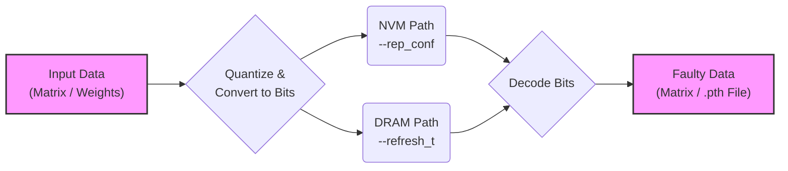
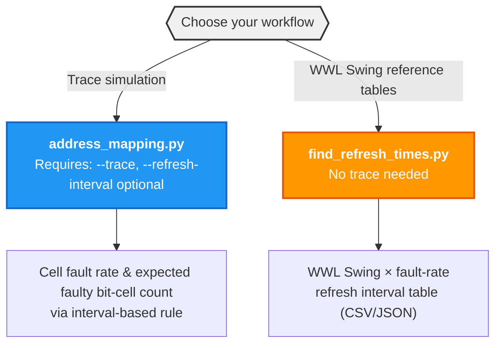

# msxFI - Memory Fault Injection Framework

Welcome to msxFI, a simple interface for quantifying the impact of memory faults and failure modes on application accuracy.

An evolution of the [Ares](https://ieeexplore.ieee.org/document/8465834) and [nvmFI](https://ieeexplore.ieee.org/document/9773239) frameworks, msxFI provides an extended PyTorch interface to model and inject memory faults. It supports fault models for both NVMs (with configurable MLC) and DRAM (based on operating conditions).

## Features

- **NVM Fault Injection**: Simulate faults in RRAM and other non-volatile memories with configurable MLC programming.
- **DRAM Fault Modeling**: Inject faults based on operating conditions and technology parameters for 1T/3T DRAM/eDRAM.
- **PyTorch Integration**: Seamlessly inject faults into neural network trainable parameters.
- **Quantization Support**: Supports a wide range of data formats, including IEEE floating-point (`float16`, `bfloat16`, `float32`, `float64`) and various fixed-point types (`signed`, `unsigned`, `int`, `afloat`).
- **Simplified Interface**: User-friendly command-line interface with clear memory model naming and automatic parameter handling.
- **Flexible Model Loading**: Supports custom model architectures via dynamic module importing.

## Dependencies

Core dependencies are PyTorch, numpy, scipy, and pandas.
For graph analytics tasks, install snapPY.
If you run DNN evaluation examples that use MNIST loading utilities, install `torchvision` as well.

## Quick Start

```bash
cd msxFI/

# Run the guided walkthrough
python demo_tutorial.py

# Run a DRAM target fault-rate sweep directly
python run_msxfi.py --mode dram333t --target_fr 0.01
```

Detailed options and workflow are provided in the sections below.

## Core Concepts

msxFI operates through a sequential pipeline to simulate memory faults. Understanding this flow is key to configuring your experiments correctly.



The process consists of two main stages:
1.  **Data Representation**: The input floating-point data is first quantized into a lower-precision format (e.g., fixed-point or float16). This quantized data is then converted into a binary bitstream. For NVM models, these bits are packed into multi-level cells based on your `--rep_conf`. For DRAM models, they are treated as a simple sequence of bits.
2.  **Fault Injection**: Faults are injected into this bit-level representation.
    -   **NVM Models** (e.g., `rram_mlc`): Use pre-calibrated error maps based on physical device characteristics. The `--rep_conf` parameter is crucial here.
    -   **DRAM Models** (e.g., `dram333t`): Generate faults based on a calculated bit-flip probability, which is determined by the `--refresh_t` and technology parameters.

> **DRAM/eDRAM Fault Model Note**: The DRAM and eDRAM fault injection models implement **retention faults only**, which manifest as **1→0 bit flips**. This models the physical behavior where a charged capacitor (storing '1') loses charge over time due to leakage current, eventually falling below the sense threshold and being read as '0'. Bits storing '0' (discharged capacitor) are not affected.

## Usage Guide

This guide provides practical examples for common use cases. All parameters are detailed in the "Parameter Reference" section below.

### Use Case 1: NVM Matrix Fault Injection

This mode injects faults directly into a data matrix using an NVM model like RRAM.

**Command:**
```bash
python run_msxfi.py \
  --mode rram_mlc \
  --q_type afloat \
  --int_bits 2 \
  --frac_bits 4 \
  --rep_conf 8 8
```

**Key Parameters for this use case:**
- `--mode`: Specifies the memory model (`rram_mlc`, `fefet_200d`, etc.).
- `--q_type`, `--int_bits`, `--frac_bits`: Define the data quantization format.
- `--rep_conf`: Defines how bits are packed into NVM cells. This is critical for NVM models. See the "Configuration Deep Dive" for validation rules.

### Use Case 2: DRAM Matrix Fault Injection

This mode simulates DRAM faults in a data matrix based on operating conditions.

**Command:**
```bash
python run_msxfi.py \
  --mode dram333t \
  --refresh_t 501 \
  --vth_sigma 50 \
  --q_type signed \
  --int_bits 3 \
  --frac_bits 5
```

**Key Parameters for this use case:**
- `--mode`: Specifies a DRAM model (`dram1t`, `dram3t`, `dram333t`).
- `--refresh_t`: **Required for DRAM.** Refresh time in microseconds. This is a crucial parameter for DRAM fault modeling.
- `--vth_sigma`: Standard deviation of threshold voltage (Vth) in mV.
- `--vdd`: **Optional.** Custom vdd in volts.
- `--wwl_swing`: **Optional.** Custom WWL Swing in volts. **Only applicable to `dram333t`**, which features an ultra-low-leakage access transistor whose Ioff can be tuned by increases WWL underdrive. Standard `dram1t`/`dram3t` cells have limited retention enhancement from WWL swing adjustment.
- Note: `--rep_conf` is not used for DRAM models.

### Use Case 2b: Finding DRAM Parameters for Target Fault Rate

This mode performs a parameter sweep to find DRAM configurations (refresh time and WWL Swing) that achieve a target fault rate. This is useful for design space exploration or finding operating points for a specific reliability target. Note that WWL Swing sweep is only meaningful for `dram333t`, whose ultra-low-leakage transistor enables WWL Swing-tunable retention.

**Command:**
```bash
python run_msxfi.py \
  --mode dram333t \
  --target_fr 0.01
```

**Output Example:**
```
Top configurations (showing up to 3 closest matches per WWL Swing):
Total configurations found: 32, displaying: 12

WWL Swing (V)   Refresh (us)   Fault Rate (%)    Error (%)
-----------------------------------------------------------------
1.25      10.0           0.010405          0.000405

1.35      129.0          0.010271          0.000271

1.40      462.0          0.009893          0.000107
1.40      463.0          0.010127          0.000127
1.40      461.0          0.009663          0.000337
```

**Key Parameters for this use case:**
- `--target_fr`: **Required for sweep mode.** Target fault rate in percentage (e.g., `0.01` for 0.01%).
- `--mode`: Should be `dram333t` for WWL Swing sweep (WWL Swing tuning is not available for `dram1t`/`dram3t`).
- The sweep searches refresh times from 1us to 64ms and WWL Swing voltages from 0.8V to 2.0V.
- Results show up to 3 closest matches per WWL swing value, sorted by error from target.
- When using `--target_fr`, other fault injection modes are disabled (matrix/DNN FI).

### Use Case 3: DNN Fault Injection

Enable DNN fault injection using the `--eval_dnn` flag. This injects faults into the weights of a pre-trained model. The same parameters for matrix injection are used to control the fault characteristics.

**Command (DRAM example):**
```bash
python run_msxfi.py \
  --mode dram333t \
  --eval_dnn \
  --model /path/to/your/model.pth \
  --model_def /path/to/your/model.py \
  --model_class YourModelClass \
  --refresh_t 1000 \
  --vth_sigma 50 \
  --q_type int \
  --int_bits 8 \
  --frac_bits 0
```

**Key Parameters for this use case:**
- `--eval_dnn`: Activates DNN fault injection mode.
- `--model`: Path to your pre-trained PyTorch model file (`.pth`).
- `--model_def`: Path to the Python script containing your model's class definition.
- `--model_class`: The name of your model's class within the definition file.

## Parameter Reference

Below is a summary of all command-line parameters for `run_msxfi.py`:

| Parameter         | Description                                                                                                | Default Value | Applicability       |
|-------------------|------------------------------------------------------------------------------------------------------------|---------------|---------------------|
| `--mode`          | Specifies the memory model (e.g., `rram_mlc`, `fefet_100d`, `dram1t`). See `fi_config.py` for all options. | (Required)    | All Modes           |
| `--q_type`        | Quantization type. **IEEE**: `float16`, `bfloat16`, `float32`, `float64`. **Fixed-point**: `signed`, `unsigned`, `afloat`, `int`. | `afloat`      | All Modes           |
| `--int_bits`      | Defines integer bits for quantization.                                                                       | 2             | All Modes           |
| `--frac_bits`     | Defines fractional bits for quantization. For `afloat`, these are exponent bits.                           | 4             | All Modes           |
| `--seed`          | Seed for random number generation for reproducibility.                                                       | random        | All Modes           |
| `--matrix_size`   | Size of the test matrix in matrix fault injection mode.                                                      | 1000          | Matrix FI           |
| `--eval_dnn`      | Enables DNN fault injection mode.                                                                            | N/A (flag)    | DNN FI              |
| `--model`         | Path to the pre-trained DNN model (`.pth` file).                                                               | N/A           | DNN FI              |
| `--model_def`     | Path to the Python file with the model's class definition.                                                   | N/A           | DNN FI              |
| `--refresh_t`     | Refresh time in microseconds (required for DRAM models).                                                     | N/A           | DRAM models         |
| `--vth_sigma`     | Standard deviation of threshold voltage (Vth) in mV.                                                       | 50            | DRAM models         |
| `--vdd`           | Custom vdd in volts for DRAM models. If not provided, uses default vdd from pickle file.        | N/A           | DRAM models         |
| `--wwl_swing`           | Custom WWL Swing (wordline voltage) in volts. **Only for `dram333t`** (ultra-low-leakage transistor). Not applicable to `dram1t`/`dram3t`. | N/A           | `dram333t` only     |
| `--target_fr`     | Target fault rate in percentage for parameter sweep mode (e.g., `0.01` for 0.01%). Enables automatic search for matching refresh_t and WWL Swing configurations. WWL Swing sweep only meaningful for `dram333t`. | N/A           | DRAM models         |
| `--rep_conf`      | Rep conf for MLC encoding. Space-separated integers (e.g., `2 2 4`).                         | `[8, 8]`      | NVM models          |
| `--model_class`   | Name of the model class in the model definition file.                                            | N/A           | DNN FI              |
| `--num_classes`   | Number of output classes for model constructor.                                                  | 10            | DNN FI              |

## Configuration Deep Dive

### Hardcoded Parameters (`fi_config.py`)

Certain global parameters that affect the underlying fault models, especially for DRAM, are configured directly within `msxFI/fi_config.py`. You will need to edit this file to change them.

Key parameters in `fi_config.py` include:
- `temperature`: Operating temperature in Kelvin (e.g., `300`). Affects DRAM fault rates.
- `feature_size`: Technology node in nm (default: `22`). Used for selecting appropriate DRAM parameters.
- `SS`: Subthreshold Swing in mV/dec (default: `90`). Affects DRAM fault rate calculations.

### NVM Configuration Validation (`--rep_conf`)

msxFI automatically validates your configuration to prevent common errors, primarily focusing on the interaction between data width (`--q_type`) and NVM cell capacity (`--rep_conf`). This validation applies to NVM models only (e.g., `rram_mlc`, `fefet_*`).

#### Check 1: Determine Data Bit Width (`--q_type`)

First, `msxFI` determines the total number of bits for your chosen data type.

| `q_type`   | Total Bits                | Description                                        |
| :--------- | :------------------------ | :------------------------------------------------- |
| `float16`  | 16                        | IEEE 754 half precision                            |
| `bfloat16` | 16                        | Brain Floating Point                               |
| `float32`  | 32                        | IEEE 754 single precision                          |
| `float64`  | 64                        | IEEE 754 double precision                          |
| `signed`   | `int_bits` + `frac_bits`  | Signed fixed-point                                 |
| `unsigned` | `int_bits` + `frac_bits`  | Unsigned fixed-point                               |
| `int`      | `int_bits` + `frac_bits`  | Two's complement integer                           |
| `afloat`   | `int_bits` + `frac_bits`  | [AdaptivFloat](https://arxiv.org/abs/1909.13271) format |

#### Check 2: Calculate NVM Cell Capacity (`--rep_conf`)

Next, it calculates the total bit capacity of the NVM cells defined by `--rep_conf`.

- Each value in `--rep_conf` must be a **power of 2** (e.g., 2, 4, 8), representing the number of levels in a cell.
- The total capacity is the **sum of bits** from all cells: `sum(log2(value) for each value in rep_conf)`.

#### Check 3: Validate Capacity vs. Data Width

Finally, the two values are compared:

- **Error**: `Cell Capacity > Data Width`
  - This is an invalid configuration. You cannot store more bits than the data type provides.
- **Error**: `Cell Capacity < Data Width`
  - This is an invalid configuration. All data bits must be mapped to a cell.
- **Valid**: `Cell Capacity == Data Width`
  - The configuration is valid with no precision loss.

#### Configuration Examples

**Valid Configurations:**
```bash
# Float16 (16 bits) with exact 16-bit rep_conf capacity
# 16 cells, each storing log2(2)=1 bit. Total = 16 * 1 = 16 bits.
python run_msxfi.py --mode rram_mlc --q_type float16 --rep_conf 2 2 2 2 2 2 2 2 2 2 2 2 2 2 2 2

# Fixed-point (2 int + 4 frac = 6 bits) with matching 6-bit capacity
# 3 cells, each storing log2(4)=2 bits. Total = 3 * 2 = 6 bits.
python run_msxfi.py --mode rram_mlc --q_type signed --int_bits 2 --frac_bits 4 --rep_conf 4 4 4
```

**Invalid Configurations (will be rejected):**
```bash
# ERROR: rep_conf values must be powers of 2 (3 is invalid)
python run_msxfi.py --mode rram_mlc --q_type float16 --rep_conf 3 3 3

# ERROR: rep_conf capacity (16 bits) < q_type width (32 bits)
python run_msxfi.py --mode rram_mlc --q_type float32 --rep_conf 4 4 4 4 4 4 4 4
```

## Updating DRAM Parameters

If you modify the underlying technology parameters in the C++ source files, you must regenerate the corresponding pickle files for the changes to take effect in `msxFI`.

**When to Regenerate:**
- After modifying `currentOffNmos` or `vdd` values in `Technology.cpp`.
- After updating cell parameters in `sample_cells/sample_edram1ts/` or `sample_cells/sample_edram3ts/`.

**To regenerate DRAM parameter files (from repo root):**
```bash
cd data_transforms/
python gen_dram_params.py
```
This updates `dram1t_args.p` and `dram3t_args.p` in `mem_data/`.

## Trace Analysis Tools

The `trace_analysis/` directory provides two complementary workflows:
1. Device-level table generation (`find_refresh_times.py`): WWL Swing to required refresh interval
2. Trace-level simulation (`address_mapping.py`): access trace to expected faulty bit-cell count and cell fault rate



- `address_mapping.py` is the main tool for trace-based fault simulation.
- `find_refresh_times.py` generates WWL Swing-to-refresh-interval lookup tables without a trace file.

### Fault Rule

Trace simulation tracks write intervals per row at bit-cell granularity.
Per-bit retention follows a DRAM-physics log-normal distribution.
When explicit refresh is configured, it caps the longest unrefreshed gap within each write interval to the refresh period.
The expected faulty bit-cell count per row is the retention CDF evaluated at the worst-case gap, scaled by the number of bit-cells per row.

- `retention`: the retention reference that anchors the per-bit distribution. Larger retention means lower fault risk.
- `refresh_interval`: explicit refresh period. Smaller interval means more frequent refresh and lower fault risk.
- For `dram333t`, the default retention reference is `501us` at `WWL Swing=1.4V` (3.5σ tail).

### Memory Model Selection

The trace analysis tools use `--mem-model` to select the DRAM type, which automatically determines the refresh behavior:

| Model | Refresh Behavior | Use Case |
|-------|------------------|----------|
| `dram1t` | Reads also refresh | 1T DRAM cells |
| `dram3t` | Only writes refresh | 3T eDRAM cells |
| `dram333t` | Only writes refresh | 333T eDRAM cells (default) |

### Trace Simulation

Run a trace through the simulator to compute expected faulty cells and cell fault rate:

```bash
cd trace_analysis/

# Scenario A: WWL Swing=1.40V, refresh=500us (small fault rate)
python address_mapping.py --trace traces/dnn_trace.csv --mem-model dram333t --refresh-interval 500

# Scenario B: WWL Swing=1.40V, refresh=800us (longer period, faults increase)
python address_mapping.py --trace traces/dnn_trace.csv --mem-model dram333t --refresh-interval 800

# Scenario C: WWL Swing=1.42V, refresh=800us (same refresh, faults reduced)
python address_mapping.py --trace traces/dnn_trace.csv --mem-model dram333t --refresh-interval 800 --wwl_swing 1.42
```

`--retention` sets the retention reference used by the per-bit retention distribution.
`--wwl_swing` lets you set wordline voltage for `dram333t`.

**Output includes:**
- Access statistics (total accesses, writes, reads)
- Refresh statistics (write refreshes, read refreshes for dram1t)
- Fault statistics (tracked cells, expected faulty cells, expected fault events)
- Cell fault rate (`faulty_cells / tracked_cells`)

Fault-stat definitions:
- `tracked_cells`: tracked bit-cells in rows reached by writes
- `faulty_cells`: expected number of faulty bit-cells
- `fault_events`: expected number of fault occurrences across write intervals at bit-cell granularity, the same bit-cell can contribute multiple times

**Trace format (CSV):**
```
timestamp,address,operation
1000,0x7fc6c03ac340,1
2000,0x7fc6c03ac480,0
...
```
- `timestamp`: time in nanoseconds
- `address`: memory address (hex or decimal)
- `operation`: `1` for write, `0` for read
- Additional columns are allowed, and the simulator reads only `timestamp`, `address`, and `operation`.

### Memory Hierarchy Configuration

The trace analysis tools support configurable eDRAM hierarchy parameters:

**Memory Configuration:**
| Parameter | Description | Default |
|-----------|-------------|---------|
| `--bank-rows` | Number of bank rows | 32 |
| `--bank-cols` | Number of bank columns | 64 |
| `--mats-per-bank` | Mats per bank | 4 |
| `--subarrays-per-mat` | Subarrays per mat | 1 |
| `--subarray-rows` | Rows per subarray | 16 |
| `--subarray-cols` | Columns (bits) per subarray | 1024 |
| `--block-size` | Cache block size (bytes) | 64 |

**Refresh Configuration:**
| Parameter | Description | Default |
|-----------|-------------|---------|
| `--banks-per-refresh` | Banks co-activated per refresh | 2 |
| `--mats-per-refresh` | Mats per bank in refresh group | 4 |

**Examples:**
```bash
# 1T DRAM with custom memory configuration
python address_mapping.py --trace trace.csv --mem-model dram1t \
    --bank-rows 16 --bank-cols 32 --refresh-interval 400

# 333T eDRAM with more banks refreshed together
python address_mapping.py --trace trace.csv --mem-model dram333t \
    --banks-per-refresh 4 --refresh-interval 500
```

## End-to-End Example: LeNet on MNIST

The `example_nn/lenet/` directory provides a complete, runnable example of using `msxFI` to inject faults into a LeNet CNN and evaluate its impact on accuracy. This is the best place to see the framework in action. A similar example for ResNet-18 on CIFAR-10 is available in `example_nn/resnet18/`.

The example includes scripts to train the model and to run the fault-injection evaluation. For detailed instructions, please refer to the dedicated README in that directory:

**[Click here for the LeNet Example README](example_nn/lenet/README.md)**

## File Structure

Key directories and files:
```
msxFI/
├── mem_data/           # Contains memory model parameter files (e.g., *.p files)
├── data_transforms/    # Data processing utilities
│   ├── gen_dram_params.py      # Script to regenerate DRAM pickle files
│   ├── data_transform_utils.py # Quantization and data format conversion utilities
│   ├── bitmask_utils.py        # Sparse encoding utilities for bitmask format
│   └── graph_utils.py          # Graph processing utilities (requires snapPY)
├── example_nn/         # Example neural network
│   ├── lenet/          # LeNet CNN implementation and training scripts
│   └── resnet18/       # ResNet-18 CNN implementation and training scripts
├── trace_analysis/     # Address trace analysis tools
│   ├── __init__.py             # Public API exports for trace-analysis modules
│   ├── address_mapping.py      # Core eDRAM hierarchy simulation engine
│   ├── address_mapping_cli.py  # CLI wrapper for address_mapping.py
│   ├── dram_physics.py         # Shared DRAM physics solver utilities
│   ├── find_refresh_times.py   # WWL Swing-to-refresh-interval table generator
│   ├── traces/                 # Sample trace files
│   └── reports/                # Generated analysis reports
├── fi_config.py        # Core configuration parameters (temperature, feature_size, etc.)
├── fi_utils.py         # Utilities for fault injection, error map generation
└── fault_injection.py  # Main fault injection logic
run_msxfi.py            # Command-line interface script
```

---

## Output

- **Matrix Mode**: Displays original vs. faulty matrices, highlighting differences.
- **DNN Mode**: Saves fault-injected model weights to the original model's directory. Filenames are generated to include key parameters for easy identification.
  - **NVM Example**: `modelname_rram_mlc_s0_qafloat_i2_f4.pth`
  - **DRAM Example**: `modelname_dram333t_s0_qint_i8_f0_rt1000.0.pth`

## Contributing

Contributions are welcome! Please feel free to submit issues, feature requests, or pull requests.

## Citation

If using msxFI for research, please cite the relevant papers. Contact authors for details.

## Authors

Original [nvmFI](https://ieeexplore.ieee.org/document/9773239) framework by Lillian Pentecost and Marco Donato, 2020.

Afloat and FeFET implementations by Emma Claus, 2023

eDRAM extensions and interface improvements by Zihan Zhang and David Kong, 2025.
